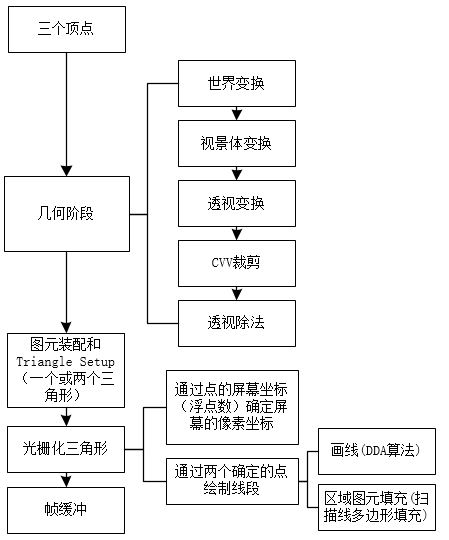

## Render3D : 光栅渲染器

### Feature
+ 数学库：向量、矩阵；
+ 几何阶段：World坐标变换、View坐标变换、透视投影变换、CVV裁剪、透视除法；
+ 图元装配和Triangle Setup：点、边、梯形、扫描线；
+ 光栅化阶段：确定屏幕像素坐标，确定像素坐标颜色，绘制点，绘制trap，绘制扫描线，绘制三角形；
+ phong着色；
+ 背面剔除；

### 绘制流水线

